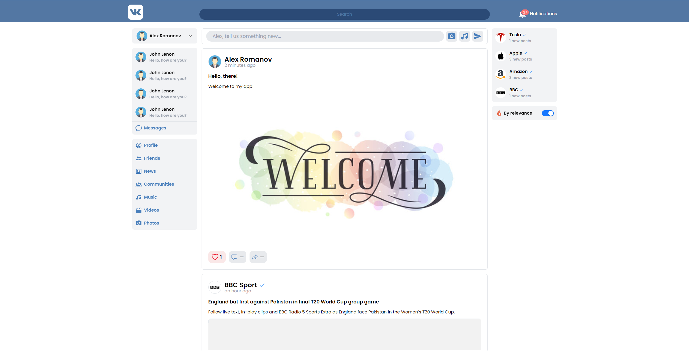
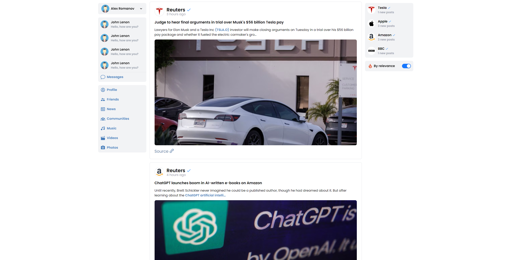

# VK-Redesign-Clone

It is a redesigned copy of the famous russian social network ["VKontakte"](https://vk.com/feed). I tried to implement the basic functionality of that app.

This project is a part of the "The Odin Project" [curriculum](https://www.theodinproject.com/).

## Table of Contents

- [Overview](#overview)
  - [Screenshots](#screenshots)
  - [Links](#links)
- [About](#about)
  - [Features](#features)
  - [Roadmap](#roadmap)
- [Built with](#built-with)

## Overview

### Screenshots

### Links

- Repository URL: [View Code](https://github.com/romaleks/VK-Redesign-Clone)
- Live Site URL: [Live Preview](https://romaleks.github.io/VK-Redesign-Clone/)

## About

### Features

- Creating account
- Reading news from all over the world
- Creating posts
- Liking posts

### Roadmap

- [ ] Implement writing comment to the post
- [ ] Implement sharing the post
- [ ] Add profile Page
- [ ] Implement making friends
- [ ] Add chat between friends
- [ ] Dark mode

## Built with

- React
- Redux-toolkit
- React Router
- Tailwind CSS
- Firebase
- Vite
- Visual Studio Code
